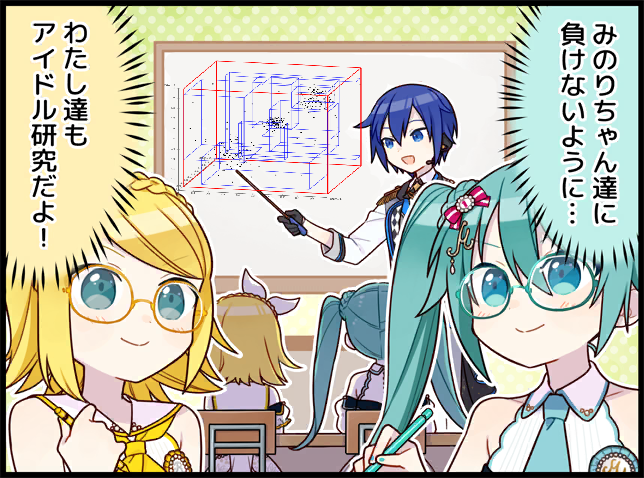

# cs163-seminar
For the CS163 - Data Structures course, me and my team (ARR-CHEESE) take on the topic **R-Tree**, which is a spatial data structure proposed by Antonin Guttman in 1984. This project consists of its implementation, a report and slides.

